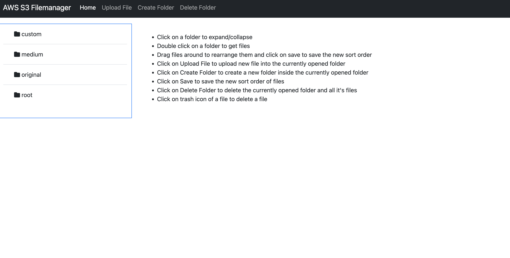
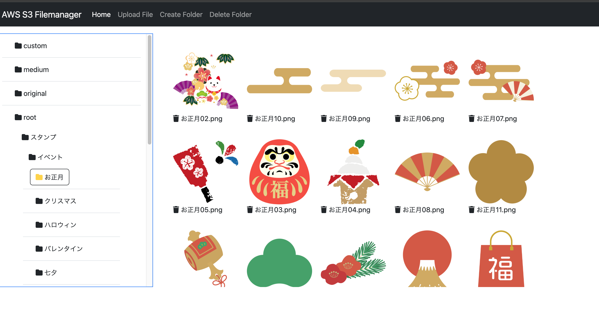

# SlimPHP AWS S3 File manager application.

### With sorting capabilities.

This is a simple file manager application that allows you to upload, <b>sort</b>, and delete files from an AWS S3 bucket. As well as create and delete folders in the bucket.

### Screenshots

### Features

- Upload files to an AWS S3 bucket.
- Sort files by dragging and dropping them.
- Delete files from the bucket.
- Create folders in the bucket.
- Delete folders from the bucket.

### Installation

1. Clone the repository.
2. Run `docker-compose up -d` to start the application.
3. Add your AWS credentials to the `.env` file.
4. Open `http://localhost:3000` in your browser.

### Usage

Instructions can be seen on the home page of the application.

### Technologies

- Docker
- PHP 8
- Slim Framework 4
- AWS SDK for PHP
- Bootstrap 5
- Twig
- SortableJS
- VSCode
- Github Copilot

### License

This project is open-sourced software licensed under the [MIT license](https://opensource.org/licenses/MIT).

---

# SlimPHP AWS S3 ファイルマネージャーアプリケーション。

### ソート機能付き。

これは、AWS S3 バケットにファイルをアップロード、<b>ソート</b>、および削除することができるシンプルなファイルマネージャーアプリケーションです。また、バケット内のフォルダーを作成および削除することもできます。

### 機能

- AWS S3 バケットにファイルをアップロードします。
- ファイルをドラッグアンドドロップしてソートします。
- バケットからファイルを削除します。
- バケットにフォルダーを作成します。
- バケットからフォルダーを削除します。

### インストール

1. リポジトリをクローンします。
2. `docker-compose up -d`を実行してアプリケーションを起動します。
3. `.env`ファイルに AWS の認証情報を追加します。
4. ブラウザで`http://localhost:3000`を開きます。

### 使い方

アプリケーションのホームページに表示される手順を参照してください。

### 技術

- Docker
- PHP 8
- Slim Framework 4
- AWS SDK for PHP
- Bootstrap 5
- Twig
- SortableJS
- VSCode
- Github Copilot

### スクリーンショット

### ライセンス

このプロジェクトは、[MIT ライセンス](https://opensource.org/licenses/MIT)の下で公開されているオープンソースソフトウェアです。
